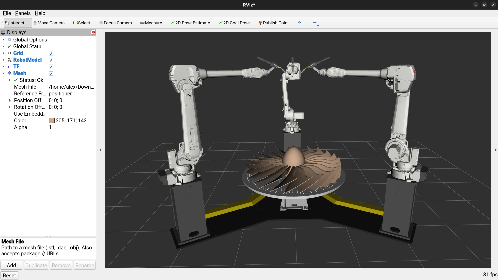

# rviz_mesh_display

The `rviz_mesh_display` package provides an RViz2 display plugin for loading an arbitrary mesh file (STL/DAE/OBJ) from disk and attaching it to a TF frame.
This facilitates viewing temporary, standalone models without publishing a `visualization_msgs/Marker` or adding a temporary URDF link.

    

The display also provides options for modifying the appearance and transformation of the model.
